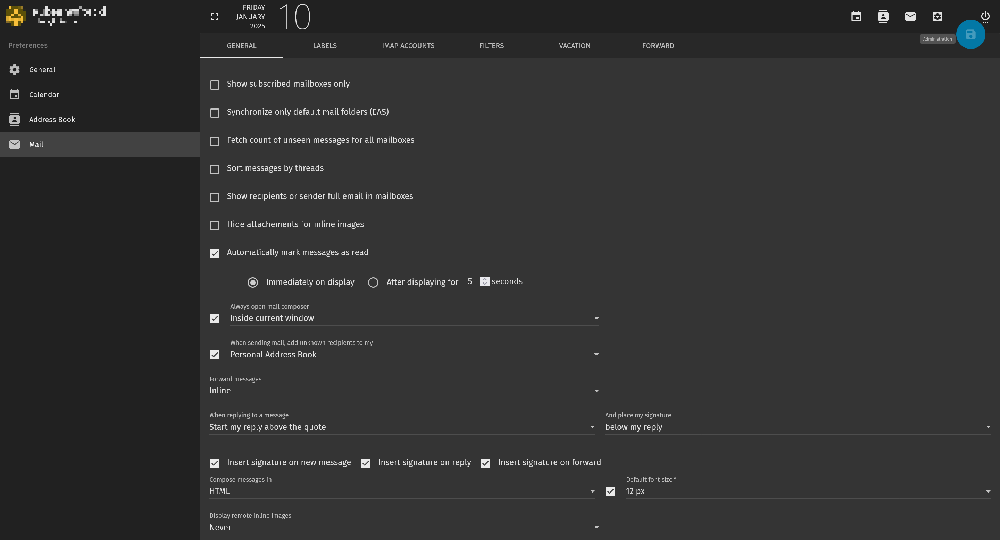

# sogo-darktheme
A dark theme for the SoGo email client. Based on the material design theme "grey" I made this very basic, mostly monochrome theme.
While at it I took the liberty to make a couple of layout elements slightly more compact without taking anything away. 

There might be visual bugs.

My SoGo v5.11 instance runs on mailcow-dockerized but this should work on any installation.

## Screenshots




## Installation
### Mailcow
Please follow [these instructions](https://docs.mailcow.email/manual-guides/SOGo/u_e-sogo/) (from step 10)

> 10. append/create docker-compose.override.yml with:
>```
> services:
>   sogo-mailcow:
>     volumes:
>       - ./data/conf/sogo/custom-theme.css:/usr/lib/GNUstep/SOGo/WebServerResources/css/theme-default.css:z
>```
> 11. Run:
>
>```
> docker compose up -d
>```
> 13. Run:
>``` 
> docker compose restart memcached-mailcow
>```
